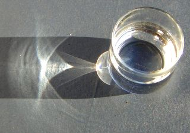

> 非物理（Blinn-Phong）的方法主要靠美工做出逼真的贴图
> 
> 材质 == BRDF，决定光线如何与材质进行作用

## 各种材质

### 漫反射/朗伯材质

- 光线在每个出射方向上均匀反射，$f_r = c$（BRDF）

$$\begin{aligned} L_{o}\left(\omega_{o}\right) &=\int_{H^{2}} f_{r} L_{i}\left(\omega_{i}\right) \cos \theta_{i} \mathrm{d} \omega_{i} \\ &=f_{r} L_{i} \int_{H^{2}} \cos \theta_{i} \mathrm{d} \omega_{i} \\ &=\pi f_{r} L_{i} \end{aligned}$$

$$\begin{aligned}f_{r}=\frac{\rho}{\pi}\end{aligned}$$

- $\rho$ 是反射率（Albedo），0~1
- 假设能量守恒，则入射光和出射光的 radiance 相等，那么反射率为 1， $\begin{aligned}f_{r}=\frac{1}{\pi}\end{aligned}$

### 光泽材质

> Glossy material，铜、铝……

### 理想反射/折射材质

> Ideal reflective / refractive material (BSDF*)，水、玻璃……

- 镜面折射（Specular Refraction）。[Caustic（焦散）](https://en.wikipedia.org/wiki/Caustic_(optics))现象：当光线穿过一个透明物体时，由于对象表面的不平整，使得光线折射并没有平行发生，而是聚焦到某些投影表面，形成明亮的边。

- 折射定律，[斯涅尔定律](https://zh.wikipedia.org/wiki/%E6%96%AF%E6%B6%85%E5%B0%94%E5%AE%9A%E5%BE%8B)（Snell's Law），全发射发生的条件，课件 17-P18
- BSDF（散射） = BRDF（反射） + BTDF（折射）
- Fresnel Reflection / Term（菲涅耳项）：反射率取决于入射角，入射光和法线夹角越小，反射率越小

### 微表面材质

> Microfacet Material

- Rough surface
  - Macroscale: flat & rough，从远处看，看到的是材质
  - Microscale: bumpy & specular，从近处看，看到的是几何
- 根据法线分布来判断是光泽表面还是漫反射表面，Concentrated <==> glossy，Spread <==> diffuse
- 效果很好
- PBR：Physically Based Rendering / Shading

### 各向同性/各向异性材质

> [!WARNING|label:Need to learn more]
> Isotropic / Anisotropic Materials(BRDFs)

## BRDF 的性质

- 非负性
- 线性：可相加
- 可逆性：$f_{r}\left(\omega_{r} \rightarrow \omega_{i}\right)=f_{r}\left(\omega_{i} \rightarrow \omega_{r}\right)$
- 能量守恒
- *各向同性*

## 测量 BRDF

- 无需推算模型
- 更精确地渲染真实材质

通过枚举入射和出射方向来测量 BRDF：

- 2D * 2D = 4D，效率低，各向同性 -> 3D
- 可逆性 -> 2D

## 存储 BRDF

